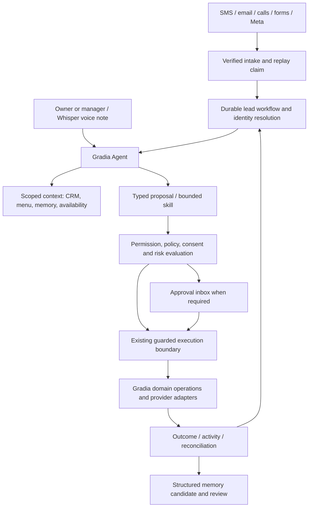

# Gradia Agent architecture

> Implementation baseline: merged `main` at
> `4552f586a3b892b4e112337aca6eb76a530dd829` (PR #45), including merged P0 PR #44.
> Product decisions **approved September 11, 2026** remain unchanged. These five
> documents are the founder-designated source of truth for the sellable MVP build;
> their approved requirements supersede conflicting historical scope documents.
> Existing implementation, future requirements and release permission are distinct.
> Release status verified September 15, 2026 (Pacific): Node 22 deployment and
> founder authentication passed; **35 production write guards remain active**.
> Public access remains restricted to the authentication test gate. Non-authentication
> delivery, crons, automatic builds and automatic domain assignment remain disabled.
> See [verified baseline and production gate](../roadmap/MVP_IMPLEMENTATION_SEQUENCE.md#verified-baseline-and-production-gate).
> This documentation-only update does not authorize feature implementation or lift
> any release gate. Protected `CONTEXT.md` and application code remain unchanged.
>
> **Evidence addendum, 2026-09-24 (Pacific).** `main` `247bb50` (PR #48) adds
> `src/lib/team-permissions.ts`, `src/lib/control-center/policy.ts` and
> `src/lib/control-center/drafts.ts`. The policy function is not wired to
> executors. Owner-only `shop.ts` resolution is no longer the only membership
> model in code; scoped manager execution is still missing. Ledgers:
> `CONTROL_CENTER_IMPLEMENTATION.md` and `../MVP_TEAM_PERMISSIONS_VERIFICATION.md`.
> September 11 architecture decisions below are unchanged.

## MVP NOW

Retain the modular Next.js/TypeScript monolith and Supabase Postgres/Auth/Storage.
One primary Agent is an experience and authority boundary, **not one unbounded
reasoning loop**. Preserve deterministic inbound pipelines and the planner →
deterministic runtime split. Reuse the existing owner-agent bounded tool loop for
interactive clarification; a plan never grants its own execution permission.

### Incremental contracts (proposed, not existing APIs)

- **Intake envelope:** workspace ID resolved from authenticated integration binding,
  source/channel, provider event ID, received time, original evidence reference and
  normalized payload. Public form tenant keys identify a configured form, not an
  arbitrary client-supplied `shop_id`. Signature checks, anti-abuse and replay claims
  precede expensive extraction or downstream work.
- **Workflow record:** stable run/lead/customer IDs, state and revision, assigned
  member/location, unresolved fields, last processed event, due time and handoff
  reason. States include identity review, qualifying, waiting for customer, awaiting
  approval, booking, booked, follow-up, held and failed. Persist transitions; don't
  infer the next step solely from a transcript or reconstruct it after a crash.
- **Command envelope:** command/action ID, initiating actor or authorized automation,
  shop/location, customer/vehicle/lead references, capability, typed payload, relevant
  policy and evidence versions, risk and causation IDs. Never accept model-selected
  tenancy, permission grants or a trusted “transactional” label.
- **Skill contract:** typed input/output, allowed capabilities, context budget,
  timeout/cost budget and completion/clarification outcome. Start with qualification,
  nurture/reply, quote/menu lookup, availability/booking, CRM updates and follow-up.
  Skills propose; Gradia owns validation and dispatch. No separate queues per skill.
- **Execution outcome:** claimed, held, succeeded, failed-before-effect or
  outcome-unknown; link provider references where available. Customer UI must not
  call an accepted transport request “delivered” without delivery evidence.

Use a minimal transactional outbox for the lead workflow where an acknowledged
intake must survive process loss: persist the event/workflow transition together,
claim work with a lease, dedupe by event and command IDs, retry only safe steps and
surface terminal/uncertain failures. Extend `provider_events` and run tracking where
semantics fit. The current best-effort `dispatchAgentEvent` is not a durable outbox;
do not claim it guarantees delivery. This narrow reliability requirement moves
ahead of the old P10 queue roadmap; a general event platform does not.

### One execution authority

Keep `pending_actions` and `src/lib/approvals.ts` for AI side effects. An autonomous
action is an authorized decision through the same executor, not a call directly to
Twilio/Aurinko from a model. Human-direct CRM and SMS paths already exist; preserve
their useful behavior while applying common authorization and send policy. Inventory
each reachable write tool (including owner-agent direct `update_customer`, MCP,
voice, crons and catalog automations) before claiming universal coverage.

At execution, recheck membership, current policy, ownership, destination, consent,
workflow revision and booking availability. Approval cannot authorize an edited
payload invisibly; edits invalidate stale proof and require a new verified proposal.
PR #44's durable proof consumption is narrower than a general command ledger: reuse
its at-most-once SMS/email guarantee and extend action identity deliberately for
other effects. Never release consumed proof after uncertain provider delivery.
Automatic resend
is prohibited. Assign the visibly held action to the responsible manager, with
owner fallback. Reconcile evidence; only confirmed non-delivery permits intentional
creation of a new action/proof. Record resolution and responsible actor.

### Notifications and communications

Whisper unifies enabled SMS, email and calls; voice notes feed the same primary
Agent. Qualification, Booking and other functional labels may explain activity,
but internal skills do not become separate personalities or data silos.

Use the in-app approval inbox plus independent transactional email. Support immediate
notifications, deduplication, quiet hours and optional daily digest. Track delivery
and retries and prevent notification loops. A replaceable provider adapter is
required; vendor choice is an implementation selection, not an architecture blocker.
Connected shop Gmail and removed Slack approvals are not notification dependencies.

### Scheduling and tenant model

Retain `shops` as the workspace root; there is no need to rename it `organizations`
for conceptual tidiness. Add memberships/invitations and location/assignment scope
through a staged RLS migration. Bootstrap one owner membership for existing shops;
preserve nullable relationships and deletion semantics. Keep `forShop` as the existing
service-role facade and tenant-reference validation; widen coverage as code changes.
A model cannot choose a shop, elevate a role or read another tenant's vectors.
MVP permits one active location or mobile service area, with multiple members,
resources and capacity schedules. Owner controls membership, connectors, billing,
exports, merges, shop-wide rules and autonomy; manager operations are delegated;
staff are assignment-scoped. Every sensitive command records its human or Gradia actor.

Reuse `availability.ts`, working-hours and `write_appointment_serialized`. Define
capacity per relevant staff/resource/location before enabling automatic booking.
Concurrent requests must arbitrate in Postgres, not just via a UI availability read.
Keep existing Aurinko behavior until a separately verified calendar adapter change:
booking currently creates external calendar state as part of execution. A minimal
native booking path plus explicit sync/reconciliation status is the desired escape
from that dependency, not a reason to replace the entire calendar now. Availability
has three states: **available, unavailable, unknown**. Unknown or stale
required-calendar state blocks automatic confirmation. Qualification and preferred-time
capture may continue, producing a held action for explicit manager resolution. Never
interpret unknown as free. Operation without the external calendar requires a
separately verified native-calendar authority design. Availability is rechecked at
execution; hard resource/capacity conflicts cannot be bypassed by ordinary approval
or autonomy settings.

### Replaceable model providers

Introduce the already-planned Gradia-owned `ModelProvider` incrementally at call
boundaries: task alias, versioned prompt, schema, tool descriptions, token/deadline
budget → typed result, actual provider/model version, usage and normalized error.
Retain current prompts and routing initially; migrate one worker and prove parity.
Claude, GPT, Grok, Gemini and future models are adapter candidates, not launch
requirements or owners of memory, tools, orchestration, pricing or consent.

Do not turn provider tool-call objects into public domain types. Model output is
untrusted input validated against Gradia schemas. **Automatic multi-model fallback
is out of MVP scope.** Retain the current
model setup behind Gradia-owned interfaces. Future provider changes require
quality, safety, cost and latency evaluations with no safety regression; any future
inference retry must never repeat an uncertain external action. Embeddings (current
1536 dimensions), speech transcription and
Vapi-hosted realtime models require separate compatibility contracts and tests.
No re-embedding or voice-provider replacement is required for this MVP document.

## ARCHITECT FOR LATER

Keep workflow/checkpoint and adapter interfaces small enough for later queue workers,
model routing and additional locations. Add version/correlation fields where they
support replay and explanation. Agent specializations may grow behind one user
identity; route only to a curated capability catalog. New connectors implement
normalization, authentication, idempotency, status and policy contracts before they
are eligible for autonomy. MCP remains a Gradia-owned tool transport, not a shortcut
to vendor credentials or raw SQL. Customer-supplied content is evidence, not system
instructions, even when retrieved from the knowledge base.

## POST-MVP

Distributed services, general agent marketplaces, dynamic code-generating skills,
large-scale workflow schedulers, automatic provider bidding and universal connector
frameworks are not needed to close this loop. Advanced resourcing and campaign
orchestration follow correctness and measured demand. No migration to a new agent
framework or raw text-to-SQL BI is proposed.

## EXISTING SUPPORT

| Evidence at baseline | Reuse and limit |
| --- | --- |
| `src/lib/agent-planner.ts`, `agent-runtime.ts`, `agent-runs.ts` | Typed recipes, deterministic scheduled/event execution, run records; not a lead conversation state machine |
| `src/lib/owner-agent.ts`, `bi-agent.ts`, `src/lib/mcp/server.ts` | Bounded owner tools and scoped query/proposal surfaces; provider wire types and some direct writes still exist |
| `src/lib/agent-events.ts`, `provider-events.ts` | Booking/payment event fan-out and webhook replay primitives; fan-out is best effort |
| `src/lib/approvals.ts`, `autonomy.ts`, `trust.ts` | Atomic approval, guarded execution, default/per-agent modes and resolution telemetry; not full connector/action policy |
| `src/lib/availability.ts`, `working-hours.ts`, `pricing.ts` | Reusable conflict/hour/capacity and menu logic; staff/location resources remain a gap |
| `src/lib/voice-provider.ts`, `telephony-provider.ts`, `crm-provider.ts` | Existing adapter boundaries; AI and calendar provider normalization remains incomplete |
| `src/lib/memory.ts`, `knowledge.ts`, `persona.ts`, `customer-context.ts` | Shared context; no need for a second brain database |
| PR #44 / `docs/P0_LOCAL_VERIFICATION.md` | Merged consent-safe merge, proof replay and tenant/photo protections; 850 unit and 156 integration passes on the PR, not new architecture verification |
| PR #45 / `src/app/auth/callback/route.ts`, `eval/auth-callback.test.ts` | Trusted production-origin redirect validation; 41 regressions and accepted founder authentication. Authentication does not grant role authority or bypass the remaining 35 release write guards |

## ARCHITECTURAL GAPS

Normalized form/Meta intake, durable qualification state, pipeline completion tools,
manager membership/RLS, unified policy resolution, notification delivery and reviewed
structured memory are genuine missing pieces. Current built UI must be extended,
not replaced by a speculative shell.

Conflicts/duplication: `custom_agents` recipe runtime and catalog `automations` both
schedule work; share command/policy/dedupe contracts before considering consolidation.
Voice tools, owner chat and MCP overlap; route to common domain operations without
forcing their different interaction patterns into one loop. Historical MCP docs
list removed Slack/HCP and payment capabilities. `availability.ts`'s “not wired yet”
header is stale relative to current approval call sites. Code comments and roadmap
checkboxes alone are not evidence of missing implementation.

## FOUNDER DECISIONS

**Approved September 11, 2026:** retain the monolith, current model setup and
Gradia-owned interfaces; no automatic multi-model fallback for MVP. One primary
Agent uses internal skills. One active location/mobile service area supports multiple
staff/resources. Role authority follows [the control model](AUTONOMY_APPROVAL_MODES.md#policy-resolution).

Unknown/stale required-calendar state prevents automatic confirmation; managers
resolve held actions explicitly. Normal bookings and menu-priced quotes may receive
separate bounded opt-ins, but hard conflicts remain non-overridable. Customer-facing
actions start approval-required. Notification vendor choice and future native-calendar
implementation are separately verified implementation work, not unresolved authority.
Full-channel release requires inbound voice; the controlled non-voice pilot does not.
This replaces D-069's first-release gate and B-18's named roster.

## ACCEPTANCE CRITERIA

- One synthetic lead from each enabled adapter reaches the same workflow. Duplicate,
  delayed and reordered events cannot cause duplicate booking or sending.
- Crash between persistence and dispatch resumes safely; a failure/hold is visible
  in Chief of Staff and assigned to a human when automation cannot finish.
- All skill outputs use typed validation; attempts to change tenant, policy or
  purpose via prompt injection have zero external effects.
- A fixture model adapter can replace the existing planner/worker without changing
  domain records, permissions or executor contracts. Provider failures fail closed.
- Two concurrent bookings obey committed capacity rules. Missing calendar knowledge
  is explicit, and rescheduling cannot bypass approval by creating a new booking.
- Every execution links intake, proposal, policy, approver/automation identity,
  domain result and audit. PR #44 protections remain regression-locked.

- Tests cover unknown/stale required-calendar state: no automatic confirmation,
  continued qualification and one held action; a hard capacity conflict is refused
  even with ordinary approval. Execution rechecks current availability.
- Notification tests prove deduplicated immediate/digest delivery, quiet-hour
  behavior, recorded retries and no recursive approval notification.
- Model outage tests prove no automatic cross-model fallback is attempted in MVP.
- Uncertain delivery produces a visible manager-owned hold (owner fallback), no
  automatic resend, and an auditable resolution before any intentional new action.

Policy: [modes](AUTONOMY_APPROVAL_MODES.md). Memory: [design](GRADIA_MEMORY.md).
