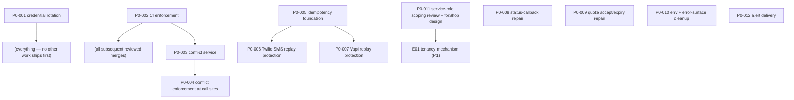
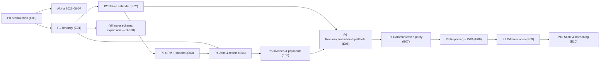

# Program — Dependency Map

_Created 2026-07-25 by the Organizer. Ticket-level dependencies for P0 and phase-level dependencies per `../10-roadmap.md`. A ticket may not enter implementation while any inbound dependency is unresolved._

## P0 ticket-level graph

Prose:

- **P0-001 precedes everything** — including the rest of P0 (roadmap sequencing rule 1). Until the credential is rotated, every other security property is moot (audit doc 00).
- **P0-002 precedes any other ticket entering review** — a reviewer needs a CI that can fail (rule 2). Hence P0-003 explicitly waits for P0-002.
- **P0-003 → P0-004**: the conflict service exists before any call site consumes it; the two share the single calendar high-risk WIP slot and are never active together.
- **P0-005 → P0-006 and P0-007**: the dedupe foundation (unique indexes / provider_events strategy, `usage_events` vendor_ref uniqueness) lands once; the two provider tickets build on it rather than inventing per-route mechanisms. **Chain complete 2026-08-14:** P0-005 done (PR #17), P0-006 done (PR #19), P0-007 done (PR #21) — neither consumer added schema. Remaining on this branch of the graph: the Aurinko email dedupe follow-up (ADR-001 C4) and P0-005A retention/pruning.
- **P0-011 → E01**: P0-011's `forShop()` helper *design* is an input to the E01 tenancy mechanism. P0-011 itself has no P0 dependencies beyond P0-001/002.
- **P0-008, P0-009, P0-010, P0-012** are independent of each other and of tracks A/B — schedulable whenever slots free (P0-009's expired-quote copy consults Q-04; P0-012's destination consults Q-08 — see `blocked.md` for what may proceed regardless).
- **P0-009 → P0-011 (soft ordering, added 2026-07-27):** both touch `approvals.ts`; P0-009's quote-linkage fix should merge before P0-011's scoping sweep re-reviews that file, so the sweep reviews final code, not code about to change.

## Decision dependencies (from `decision-queue.md`)

| Ticket / work | Decision | Effect |
|---|---|---|
| P0-001 (history-scrub sub-step only) | Q-01 | Rotation proceeds; scrub waits |
| P0-009 (expired-quote visitor copy) | Q-04 | Minimal honest state ships regardless |
| P0-012 (destination config) | Q-08 | Seam builds regardless |
| E01 trial build | Q-13 | Design only until numbers land |
| E02 Microsoft sync ordering | Q-09 | Scoping input |
| E03 lifecycle wiring | Q-02 | Hard blocker for that item |
| E03 direct customer create | Q-03 | Rec: build |
| P3-001 HCP dependency review (E03) | feeds Q-19 | Depends only on P0-exit sprint discipline; its report is Q-19's evidence |
| E03 Jobber import posture | Q-20 | Keep optional/demand-driven; never core |
| Post-E02 direct Google/Microsoft evaluation | Q-21 | Aurinko stays transitional (D-030) until `CalendarProvider` is stable |

## Phase-level graph (per `../10-roadmap.md` sequencing rules)

Prose (the binding rules, restated from the roadmap):

1. Alpha requires **P0 complete**; nothing from P1+ is an alpha blocker (miss-the-date policy: Q-25).
2. **P1 precedes all major schema expansion** (D-018): E02/E04/E05/E06 tables are not created until members/roles land — **E02 added 2026-07-27** (it creates `calendar_connections`/`external_busy_blocks`; the "E01 recommended" softness is retired, see E02 §Dependencies).
3. **P2 precedes P6** (recurring/memberships/fleets book against native availability) and precedes any online-booking surface.
4. **P5 precedes P6 memberships** (membership billing) and the quote-deposit flow.
5. Later phases may start early **only** when their specific inbound dependencies (not the whole prior phase) are done — the Organizer records any such early start here with justification.
6. High-risk WIP: only one of {payments, tenancy, calendar} in active implementation at any time, across all phases.
7. **P4 precedes advanced reporting (added 2026-07-27, roadmap rule 8):** E08's job-dependent reports (profitability, productivity, utilization) require E04 done; non-job reports may proceed on their own source domains.
8. **Reliable event processing precedes autonomy expansion (added 2026-07-27, roadmap rule 9):** E09 requires P0-005/006/007 + P0-012 complete (status 2026-08-14: P0-005/006/007 done; **P0-012 still outstanding** — the gate is not yet satisfied); the E10 outbox is not the bar, but E09 tickets on webhook/cron paths state their idempotency basis.
